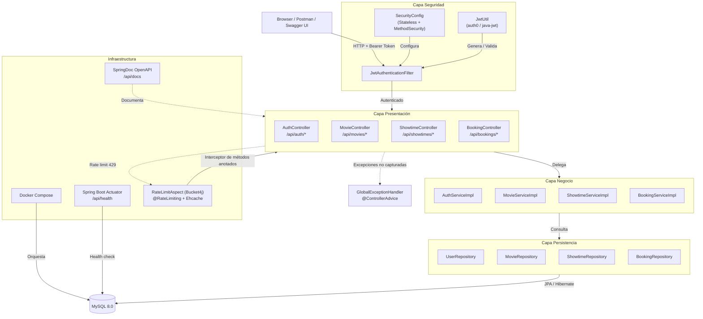

# Arquitectura del Proyecto — Cineplanet 2026 Backend

Este documento describe la arquitectura, patrones y decisiones técnicas del backend desarrollado para el reto técnico de Cineplanet 2026.

---

## 1. Patrón de Arquitectura: Layered Architecture (Arquitectura por Capas)

Se adoptó una **Layered Architecture** clásica de tres capas, ampliada con una capa de infraestructura transversal. Este es el patrón estándar recomendado por Spring y resulta ideal para APIs REST de dominio medio porque:

| Ventaja | Justificación para este proyecto |
|---------|--------------------------------|
| **Separación de responsabilidades** | Cada capa tiene un propósito único: HTTP, lógica de negocio o persistencia. Esto facilita la lectura del código por parte de evaluadores técnicos. |
| **Testabilidad** | Los `Service` son pura lógica de negocio sin dependencias de frameworks web; pueden probarse con unit tests ligeros (Mockito). Los `Controller` pueden probarse con `MockMvc`. |
| **Bajo acoplamiento** | La inyección de dependencias de Spring permite reemplazar implementaciones sin tocar el consumidor. Por ejemplo, los repositorios son interfaces (`MovieRepository`) cuya implementación real la provee Spring Data JPA. |
| **Escalabilidad cognitiva** | El dominio (películas, funciones, reservas) es suficientemente complejo como para justificar capas, pero no requiere DDD/CQRS/Event Sourcing que elevarían innecesariamente la complejidad de un challenge técnico. |

### Responsabilidades por capa

| Capa | Paquete | Responsabilidad |
|------|---------|-----------------|
| **Presentación** | `controller` | Expone endpoints REST, valida DTOs de entrada (`@Valid`), delega a servicios y encapsula la respuesta en `ApiResponseDTO`. |
| **Negocio** | `service` / `service.impl` | Contiene la lógica del dominio: filtrado de películas, validación de disponibilidad de asientos, emisión de tickets, encriptación de contraseñas. |
| **Datos** | `repository` / `model` | Define entidades JPA (`Movie`, `Showtime`, `Booking`, `User`) y contratos de acceso a datos. La persistencia real es manejada por Spring Data JPA + Hibernate. |
| **Infraestructura transversal** | `config`, `exception`, `util` | Seguridad (JWT, Spring Security), manejo global de excepciones (`@ControllerAdvice`), utilidades (generación de tokens), y configuración de documentación (OpenAPI). |

---

## 2. Diagrama de Componentes

### Descripción de los componentes

El diagrama muestra cuatro capas principales más dos bloques transversales:

- **Capa Seguridad**
  - `JwtAuthenticationFilter` intercepta cada request HTTP antes de que llegue al controller, valida el JWT y carga el usuario en el `SecurityContext`.
  - `SecurityConfig` define la cadena de filtros: sesiones stateless, endpoints públicos (Swagger, login) y endpoints protegidos. También habilita `@PreAuthorize` para autorización por roles.
  - `JwtUtil` es la utilidad basada en `auth0/java-jwt` que genera y valida tokens.

- **Capa Presentación**
  - `AuthController` expone registro (`/api/auth/register`) y login (`/api/auth/login`).
  - `MovieController` gestiona el catálogo de películas: listado paginado, detalle con funciones próximas, creación, actualización y soft delete (solo `ADMIN`).
  - `ShowtimeController` administra las funciones (horarios de proyección) de cada película.
  - `BookingController` permite a un `CUSTOMER` crear reservas de tickets para una función disponible.

- **Capa Negocio**
  - `AuthServiceImpl` maneja encriptación BCrypt de contraseñas y emisión de JWT tras login exitoso.
  - `MovieServiceImpl` aplica filtros por género/clasificación y paginación; también ensambla la respuesta `MovieResponse` incluyendo las funciones próximas.
  - `ShowtimeServiceImpl` valida reglas de negocio como conflictos de horario al crear funciones.
  - `BookingServiceImpl` valida disponibilidad de asientos y crea la reserva vinculada al usuario autenticado.

- **Capa Persistencia**
  - Cuatro repositorios Spring Data JPA (`UserRepository`, `MovieRepository`, `ShowtimeRepository`, `BookingRepository`) abstraen el acceso a datos. La entidad `Movie` usa `@SQLDelete` y `@SQLRestriction` para soft delete.

- **Base de Datos**
  - MySQL 8.0 almacena todas las entidades. En entornos de test se usa Testcontainers con la misma imagen `mysql:8.0` para garantizar fidelidad de dialecto y queries.

- **Infraestructura transversal**
  - `GlobalExceptionHandler` (`@ControllerAdvice`) captura excepciones de toda la aplicación (`ResourceNotFoundException`, `BusinessRuleException`, `AccessDeniedException`, `RateLimitException`, etc.) y las convierte en respuestas `ApiResponseDTO` con el código HTTP correcto.
  - `RateLimitAspect` (Bucket4j) intercepta los métodos de controller anotados con `@RateLimiting`, aplica un token bucket por IP/usuario y, al excederse, responde `429 Too Many Requests` con `Retry-After`.
  - Docker Compose orquesta los contenedores de la aplicación y la base de datos.
  - Spring Boot Actuator expone `/api/health` para health checks.
  - SpringDoc OpenAPI genera la documentación interactiva accesible en `/api/docs`.

### Flujo de una petición exitosa (Happy Path)

1. **Cliente** envía `GET /api/movies` con header `Authorization: Bearer <token>`.
2. **`JwtAuthenticationFilter`** intercepta la petición, valida el token con `JwtUtil` y establece el `Authentication` en el `SecurityContext`.
3. **`SecurityConfig`** verifica que el endpoint requiere autenticación (`anyRequest().authenticated()`).
4. **`MovieController`** recibe la petición, valida parámetros de query/pagination y delega a `MovieServiceImpl`.
5. **`MovieServiceImpl`** ejecuta lógica de negocio (filtrado por género/clasificación) y consulta `MovieRepository`.
6. **`MovieRepository`** (Spring Data JPA) traduce el método a SQL y ejecuta contra **MySQL**.
7. El resultado asciende de vuelta, el controller lo envuelve en `ApiResponseDTO<T>` y responde JSON.

### Flujo de error (dato inválido)

Supongamos que el cliente envía `POST /api/movies` con un body inválido (por ejemplo, `duration: 0`, que viola `@Min(1)`):

1. **Cliente** envía la petición HTTP al `MovieController`.
2. **`JwtAuthenticationFilter`** valida autenticación (igual que en el happy path).
3. **Spring Validation** (`@Valid`) intercepta el body antes de entrar al método del controller. Como `duration: 0` no cumple la restricción, lanza **`MethodArgumentNotValidException`**.
4. El controller nunca llega a ejecutarse. Spring detecta que la excepción no fue capturada dentro del controller.
5. **`GlobalExceptionHandler`** (marcado con `@ControllerAdvice`) es invocado automáticamente por Spring MVC. El handler mapea `MethodArgumentNotValidException` a un `ApiResponseDTO` con código `400 Bad Request` y la lista de errores de validación (`duration must be greater than or equal to 1`).
6. El cliente recibe directamente la respuesta de error estandarizada.

> **Nota importante:** El `GlobalExceptionHandler` no es llamado explícitamente por los controllers. Es un **mecanismo transversal del framework**: Spring MVC captura cualquier excepción no manejada que surja durante la ejecución de un controller (o de cualquier servicio/repositorio invocado por él) y la deriva al handler correspondiente. Por eso en el diagrama la flecha punteada va desde la Capa de Presentación hacia el `GlobalExceptionHandler`, representando que el control pasa al handler cuando algo falla.

---

## 3. Decisiones Técnicas

### 3.1 Framework: Spring Boot 4.0.7 + Java 21

- **Java 21 (LTS)** provee características modernas (records, pattern matching, virtual threads-ready) mientras mantiene estabilidad a largo plazo.
- **Spring Boot** es el estándar de facto en el ecosistema Java. Su inyección de dependencias, auto-configuración y ecosistema maduro (Security, Data, Validation, Actuator) aceleran el desarrollo sin sacrificar flexibilidad.
- Se eligió la versión `4.0.x` (basada en Spring Framework 6.x) por compatibilidad con Jakarta EE (`jakarta.*` namespace) y soporte nativo de Tomcat 11.

### 3.2 Base de Datos: MySQL 8.0

- **Modelo relacional** es natural para este dominio: `Movie` → `Showtime` → `Booking` → `User` requieren integridad referencial, transacciones ACID y consultas estructuradas (filtrado, paginación, joins).
- MySQL 8.0 soporta **Window Functions** y **CTE** para reportes futuros, además de mejoras de rendimiento en índices.
- Se usa **Testcontainers** (`mysql:8.0`) en tests de integración para garantizar que las queries JPA se ejecutan contra una base real, no H2, eliminando diferencias de dialecto.

### 3.3 Seguridad: JWT (auth0/java-jwt) + Spring Security

- **JWT (JSON Web Token)** fue elegido sobre sesiones server-side porque la API es **stateless**: no hay estado de sesión en el servidor, facilitando horizontal scaling y compatibilidad con clientes móviles/SPAs.
- Se usa la librería `com.auth0:java-jwt` en lugar de `jjwt` por su API más concisa, documentación clara y mantenimiento activo.
- **Spring Security** con `@EnableMethodSecurity` permite control de acceso declarativo (`@PreAuthorize("hasRole('ADMIN')")`) directamente en los controllers, manteniendo las reglas de autorización visibles junto a la lógica de negocio.

### 3.4 Persistencia: Spring Data JPA + Hibernate

- **Spring Data JPA** reduce drásticamente el boilerplate de acceso a datos: interfaces como `MovieRepository` heredan paginación, CRUD y queries derivadas sin escribir SQL.
- **Hibernate** como proveedor JPA permite usar anotaciones de soft delete (`@SQLDelete`, `@SQLRestriction`) para no perder histórico de películas eliminadas, una decisión de negocio común en sistemas de reservas.
- Las entidades usan **UUID** como clave primaria (`GenerationType.UUID`) para evitar secuencias predecibles y facilitar futura replicación/distribución.

### 3.5 Documentación: SpringDoc OpenAPI

- `springdoc-openapi-starter-webmvc-ui` genera la especificación OpenAPI 3.x automáticamente a partir de las anotaciones de Spring y los DTOs.
- Se configuró una ruta custom (`/api/docs`) para mantener consistencia con el prefijo `/api` de todos los endpoints.
- Incluye anotaciones de seguridad (`@SecurityRequirement`) para que Swagger UI sepa que ciertos endpoints requieren Bearer token.

### 3.6 Testing: JUnit 5 + Mockito + Testcontainers

- **Mockito** para unit tests de servicios aislados (sin base de datos, sin Spring context).
- **Testcontainers** para tests de integración que requieren validar queries reales, migraciones de schema y transacciones.
- **GitHub Actions** ejecuta ambos tipos de test en CI, levantando el contenedor de MySQL durante la fase de test.

### 3.7 Build & Deploy: Gradle + Docker Compose

- **Gradle** (con Groovy DSL) fue elegido por mejor performance de build incremental y daemon nativo.
- **Docker Compose** orquesta dos servicios:
  - `db`: MySQL 8.0 expuesto en puerto `3308` (evita conflicto con instancias locales de MySQL en `3306`).
  - `api`: Aplicación Spring Boot en puerto `8090` con healthcheck dependiente de la base de datos.
- Se usa un archivo `.env` para externalizar configuración (credenciales, puertos) sin hardcodear en el `docker-compose.yml`.

### 3.8 Librerías destacadas

| Librería | Versión | Propósito |
|----------|---------|-----------|
| `spring-boot-starter-security` | 4.0.7 | Seguridad, filtros, autorización |
| `java-jwt` (auth0) | 4.4.0 | Generación y validación de tokens JWT |
| `springdoc-openapi-starter-webmvc-ui` | 3.0.2 | Documentación interactiva Swagger UI |
| `lombok` | última | Reducción de boilerplate (getters, builders, etc.) |
| `testcontainers` | 1.19.8 | Tests de integración con MySQL real |
| `spring-boot-starter-validation` | 4.0.7 | Validación declarativa de DTOs (`@NotBlank`, `@Min`) |
| `bucket4j-spring-boot-starter` | 0.14.0 | Rate limiting por anotación `@RateLimiting` (token bucket) |
| `spring-boot-starter-aspectj` | 4.0.7 | Infraestructura AOP requerida por `@RateLimiting` |
| `spring-boot-starter-cache` + `ehcache` (jakarta) | 4.0.7 | Cache in-memory donde se persiste el estado de los buckets |

### 3.9 Rate Limiting: Bucket4j + anotación declarativa

Se adoptó **Bucket4j** (`bucket4j-spring-boot-starter`) para limitar el tráfico de los endpoints vía la anotación `@RateLimiting(name = "...")`:

- **Token bucket por defecto**: capacidad = ráfaga máxima permitida; refill greedy de tokens por minuto. El estado de cada bucket vive en una cache **Ehcache in-memory** (`cache-name: buckets`, TTL 1h).
- **Configuración declarativa**: los límites y la cache-key se definen en `application.yml` bajo `bucket4j.methods`, y cada método del controller referencia un bucket por nombre con `@RateLimiting`. Esto mantiene el límite visible junto al endpoint y centraliza los valores.
- **Cache-key por consumidor**: los endpoints públicos se limitan por **IP** (`@requestInfo.ip()`) y los autenticados por **usuario** (`@requestInfo.username() ?: @requestInfo.ip()`). El bean `RequestInfo` resuelve ambos valores y se referencia desde las expresiones SpEL.
- **Respuesta 429**: cuando se excede el límite, Bucket4j lanza `RateLimitException`; el `GlobalExceptionHandler` la convierte en `ApiResponseDTO` con HTTP `429` y el header `Retry-After`.
- **Endpoints exentos**: health, info, Swagger y la documentación no llevan `@RateLimiting`, por lo que nunca se ven bloqueados (importante para healthchecks).
- **Limitación**: al ser in-memory, el límite es **por instancia**. Para un despliegue multi-nodo habría que migrar a un cache distribuido (Redis/Hazelcast) que el propio starter soporta.

Límites definidos (justificación):

| Bucket | Endpoints | Capacidad / min | Clave | Justificación |
|--------|-----------|-----------------|-------|---------------|
| `login` | `POST /api/auth/login` | 10 | IP | Prevenir fuerza bruta / credential stuffing |
| `register` | `POST /api/auth/register` | 5 | IP | Prevenir spam de cuentas |
| `movies-read` | `GET /api/movies*` | 120 | IP | Lectura pública barata |
| `showtimes-read` | `GET /api/showtimes*` | 120 | IP | Lectura pública barata |
| `bookings-create` | `POST /api/bookings` | 10 | usuario | Escritura con lock pesimista; evitar acaparamiento/DoS |
| `bookings-read` | `GET /api/bookings/{id}` | 60 | usuario | Lectura autenticada |
| `admin-write` | `POST/PUT/DELETE /api/movies*`, `POST /api/showtimes` | 30 | usuario | Escrituras admin de bajo volumen |

---

## 4. Principios de diseño aplicados

- **DRY (Don't Repeat Yourself)**: `ApiResponseDTO<T>` estandariza la estructura de respuesta para éxito y error en todos los controllers. `GlobalExceptionHandler` centraliza el mapeo de excepciones a HTTP.
- **Single Responsibility**: Cada clase tiene una razón de cambio. Por ejemplo, `MovieServiceImpl` solo orquesta lógica de películas; no conoce detalles HTTP.
- **Fail fast**: Validaciones de entrada (`@Valid`) ocurren en la capa de presentación antes de llegar a negocio. Las reglas de dominio (`BusinessRuleException`) ocurren en servicios.

---

## 5. Convenciones del proyecto

- **Base path**: Todos los endpoints REST comienzan con `/api`.
- **Paginación**: Listados usan `org.springframework.data.domain.Pageable` con valores por defecto (`@PageableDefault`).
- **Soft delete**: Entidades de catálogo (`Movie`) usan flag `is_deleted` en lugar de `DELETE` físico, preservando integridad histórica de reservas.
- **Roles**: Dos roles (`ADMIN`, `CUSTOMER`) implementados como `Enum` y validados vía `@PreAuthorize`.
